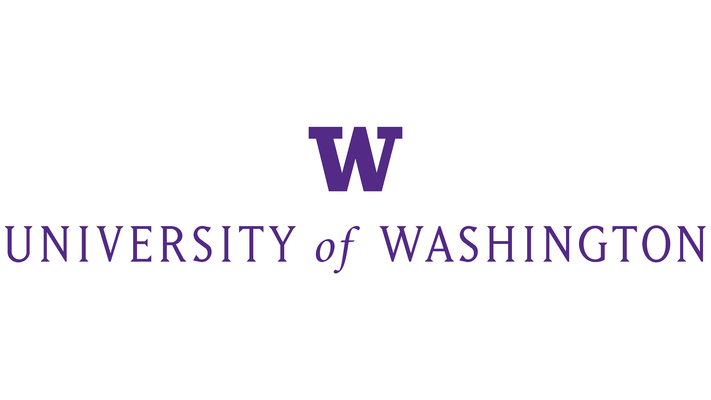

# **Lilian Law**

*lilianml@uw.edu* | (206)-954-4616 | [https://www.linkedin.com/in/lilian-law-283641220/](https://www.linkedin.com/in/lilian-law-283641220/)

---

> **EDUCATION**

Geography Data Science, University of Washington, Seattle Expected June 2026

*Relevant Coursework:* Data Science Methods, Intermediate Data Programming, Intro to Database Systems, Data Structures and Algorithms, Computer Programming I & II, Foundational Skills for Data Science, Statistical Reasoning, Calculus with Analytical Geometry Series, Advanced Ditigal Geographies, Web GIS, GIS and Mapping

---

> **WORK EXPERIENCE**

#### **University of Washington Education Department - IT Helpdesk Support - Seattle, WA (June 2023 - Present)**
- Trained new student workers
- Improved department’s overall efficiency via deployment of PowerShell and Bash automated scripts 
- Upheld University standards by providing reliable, on-demand troubleshooting and repair services for technology in 7 classrooms
- Internally published troubleshooting and diagnostic materials using personal expertise for on site work and job training
- Introduced and enforced organizational standards to over 40 devices and hundreds of accessories within the department’s inventory
- Tested and deployed Jamf and Active Directory     
- Managed up to 20 tickets per week by establishing reliable communication with clients while developing individualized plans of action
  
#### **Fred Hutch - Research Intern - Seattle, WA (July - September 2023)**
- Applied expertise in R by creating and submitting the ebest R package for Empirical Bayes population-specific association analysis to Cran
- Maintained integrity of the sMiST R package 
- Contributed to leading edge biostatistics cancer research under the guidance of a Biostatistician     

#### **University of Washington Allen School - Teaching Assistant CSE 122 - Seattle, WA (January - March 2023)**
- Developed course material and facilitated education for up to 30 students  
- Proctored and scored exams 
- Guided and tutored students 

---

> **SKILLS**

*Scripting Languages:* Python, PowerShell, Bash, R, SQL

*Operating Systems:* Windows (Windows 7, Windows 8, Windows 10, Windows 11, Windows Server 2019, Windows Server 2022, Windows Server 2025), MacOS, Linux (Ubuntu Desktop, Linux Mint, Kali Linux, KDE Neon)

*Technologies:* ProxMox, VMware, Docker, Jamf, Apple Configurator, Freshservice ticket system, TeamViewer, Parsec, Microsoft Office, Adobe Acrobat Pro
  
#### **Leadership:**

- *Batman’s Kitchen* - Co-President - Seattle, WA (February 2022 - Present)
- *Washington Gaming Association Magic: The Gathering* - President - Seattle, WA (September 2021 - Present)

---

> **PROJECTS**

#### **PowerShell and Bash Automation - UW College of Education IT Department (July 2023 - Present)**
- Learned PowerShell to create and deploy a script to rename a computer, join and add it to the Active Directory domain, install all Windows updates, find, download, and install the latest version of all necessary programs and drivers, and restart the computer as needed  
- Learned Bash to create and deploy a script for Macs to rename the computer, add it to the inventory system, and install the latest versions of the necessary programs and drivers
- Increased computer deployment efficiency through implementation of PowerShell and Bash scripts
- Created documentation and taught coworkers how to deploy the scripts to new machines  

#### **Homelab Project - Personal Project (October 2021 - Current)**
- Installed Opnsense on a machine to learn about and practice firewalls, routers, DNS, DHCP, and computer networking 
Implemented an instance of Active Directory in Windows Server 2019, 2022, and 2025 to gain familiarity and practice Active Directory and MDT  
- Created VMs in HyperV, VMware Workstation, and Virtual Box to test software and for use in CTFs  
- Built a desktop computer and applied knowledge from a A+ certification book 
- Became familiar with Kali Linux, Ubuntu, Linux Mint, KDE Neon, and other Linux distros  